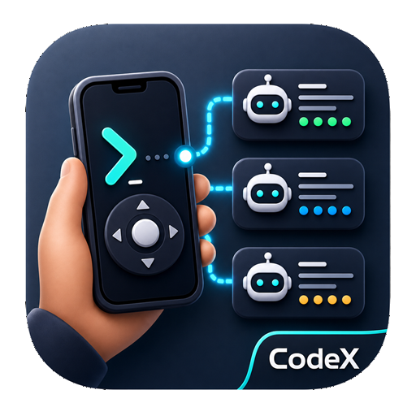

<div align="center">
  

  <h1>EasyCodex</h1>
  <p><strong>在电脑上启动 Codex，用 Android 手机远程控制。</strong></p>
  <p>
    <a href="README.md">English</a> |
    <a href="README.zh-CN.md">简体中文</a> |
    <a href="README.zh-TW.md">繁體中文</a>
  </p>
  <p>
    <a href="https://github.com/Ryan-Laws/easycodex/releases/tag/v0.1.1"></a>
    <a href="LICENSE"></a>
    
    
    
    
    
    <a href="https://visitor-badge.laobi.icu/"></a>
  </p>
  <p>
    <a href="https://github.com/Ryan-Laws/easycodex/releases/tag/v0.1.1"><strong>下载 EasyCodex 0.1.1</strong></a>
    ·
    <a href="https://github.com/Ryan-Laws/easycodex/releases">全部 Release</a>
  </p>
</div>

EasyCodex 是一个本地优先的 Codex 编程智能体远程控制应用。你在电脑上运行桌面端中继，在 Android 手机上安装移动端，扫码连接后，就可以用手机管理 Codex 会话，而真正的智能体执行仍然留在你的电脑上。

当前公开版本已经提供可直接使用的 Windows、macOS、Linux 中继程序和 Android APK。普通用户不需要克隆仓库才能体验。

## 安装 EasyCodex

从 [EasyCodex 0.1.1](https://github.com/Ryan-Laws/easycodex/releases/tag/v0.1.1) 下载当前版本。在 GitHub 页面上，也可以从仓库右侧的 **Releases** 入口进入发布页，再选择最新的 EasyCodex 版本。

| 平台 | 下载 | 用途 |
| --- | --- | --- |
| Windows | [`EasyCodex.Relay.Setup.0.1.1-x64.exe`](https://github.com/Ryan-Laws/easycodex/releases/download/v0.1.1/EasyCodex.Relay.Setup.0.1.1-x64.exe) | 推荐的 Windows 桌面端中继安装包 |
| Windows | [`EasyCodex.Relay.Portable.0.1.1-x64.exe`](https://github.com/Ryan-Laws/easycodex/releases/download/v0.1.1/EasyCodex.Relay.Portable.0.1.1-x64.exe) | 免安装便携版 Windows 中继 |
| Android | [`EasyCodex.Mobile.0.1.0.apk`](https://github.com/Ryan-Laws/easycodex/releases/download/v0.1.0/EasyCodex.Mobile.0.1.0.apk) | Android 手机应用 |
| macOS Apple Silicon | [`EasyCodex.Relay.0.1.1.mac-arm64.dmg`](https://github.com/Ryan-Laws/easycodex/releases/download/v0.1.1/EasyCodex.Relay.0.1.1.mac-arm64.dmg) | Apple Silicon 桌面端中继 |
| macOS Intel | [`EasyCodex.Relay.0.1.1.mac-x64.dmg`](https://github.com/Ryan-Laws/easycodex/releases/download/v0.1.1/EasyCodex.Relay.0.1.1.mac-x64.dmg) | Intel 桌面端中继 |
| Linux | [`EasyCodex.Relay.0.1.1.linux-x64.AppImage`](https://github.com/Ryan-Laws/easycodex/releases/download/v0.1.1/EasyCodex.Relay.0.1.1.linux-x64.AppImage) | 免安装 Linux 中继 |
| Linux | [`EasyCodex.Relay.0.1.1.linux-x64.deb`](https://github.com/Ryan-Laws/easycodex/releases/download/v0.1.1/EasyCodex.Relay.0.1.1.linux-x64.deb) | Debian/Ubuntu 安装包 |

## 快速开始

1. 在电脑上安装并登录 OpenAI Codex CLI。
2. 在 Windows 或 macOS 上安装并打开 **EasyCodex Relay**。
3. 在桌面端应用里点击启动中继。它会显示中继状态、连接地址、API Key 和二维码。
4. 在 Android 手机上安装 `EasyCodex.Mobile.0.1.0.apk`。
5. 用手机扫描二维码，或在应用内打开连接链接。
6. 选择工作区，创建或恢复 Codex 会话，然后用手机控制智能体。

手机不会直接运行 Codex。它通过 WebSocket 连接到桌面端中继，由中继在本机仓库旁边启动 `codex app-server`。

## 你可以做什么

- 创建、恢复、中断和停止 Codex 智能体会话。
- 在手机上实时查看 Codex 流式回复。
- 智能体忙碌时继续排队发送消息。
- 在本地操作执行前，通过手机处理审批提示。
- 浏览工作区文件、检查 Git 状态、查看 diff，并使用分支和 worktree。
- 在任务完成时接收本地中继事件和可选手机通知。
- 通过二维码或 `easycodex://connect` 深链接快速配对。

## 技术栈

| 模块 | 技术 |
| --- | --- |
| Android 应用 | Kotlin、原生 Android、Jetpack Compose、Material 3、OkHttp、Google Code Scanner |
| 桌面端中继 | Electron、electron-builder、内置本地中继启动器 |
| Agent Relay | Node.js 18+、TypeScript、Express、`ws`、`simple-git`、Codex `app-server` JSON-RPC |
| 开发工具 | PowerShell 友好的 Node.js 脚本和 GitHub Actions 发布构建 |

## 架构

```text
Android app <-> EasyCodex Relay <-> codex app-server <-> Codex thread
```

中继采用本地优先设计。它使用 relay API Key 验证移动端客户端，启动和管理 Codex 进程，转换 Codex JSON-RPC 事件，并向应用暴露明确的文件、Git、工作区操作。

## 环境要求

- 用于运行桌面端中继的 Windows 或 macOS 电脑
- Android 真机或模拟器
- 电脑上已安装并登录 OpenAI Codex CLI
- 手机和电脑在同一个可信网络内，或通过 Tailscale 等私有网络连接

## 从源码构建

大多数用户应该从 Release 页面安装。只有在开发 EasyCodex 本身时才需要这些命令。

```powershell
# 桌面端中继
Set-Location desktop-relay
npm install
npm start

# Agent Relay
Set-Location agent-relay
npm install
npm run build

# Android 应用
Set-Location mobile
gradle assembleDebug
```

## 仓库结构

```text
EasyCodex/
├── mobile/          Android 原生手机应用
├── agent-relay/     Codex 的 Node.js Agent Relay
├── desktop-relay/   Electron Windows/macOS 桌面端中继
└── scripts/         CLI 和本地安装辅助脚本
```

## 安全模型

- 中继要求 WebSocket 客户端和健康检查提供 API Key。
- 请把中继访问视为高权限访问：它可以读取工作区文件、检查 Git 状态，并在工作目录中启动 Codex。
- 日常使用建议放在可信 LAN 或私有网络内。
- 不要提交 API Key、中继密钥、OpenAI Token、本地 agent 状态或私有环境文件。

## 文档

- [APP.md](APP.md) 介绍应用架构和本地运行模型。
- [AGENT.md](AGENT.md) 说明由中继管理的 Codex 智能体、WebSocket action 和运行时行为。
- [desktop-relay/README.md](desktop-relay/README.md) 说明桌面端中继的打包和发布构建。

## 许可证

EasyCodex 基于 [MIT License](LICENSE) 发布。
